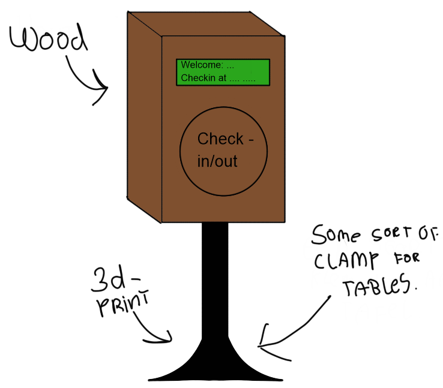

# Concept

**Goal:** The goal of the deign is for the user to immediatly see they have to check-in and out.  
For the physical side of things I would love to have something like an public check-in device, I want to get my inspiration from that. Childeren under 4 years of age are allowed to ride for free. Which means everybody above 4 should be able to use the check-in device, ofcourse childeren under 12 usualy don't go alone and have parents who will check in for them. This would mean the devices are probably for people between 14/16 to very elderly. In companies the range of employees ages are between 16-67 which falls perfectly in line with the public transport device. My design is almost gonna look exactly like the public transport device because, people tend to like familiarity so thats why my design will be a wooden copy of the original. 
Here is an example of how I would like my device to turn out to be: 
 
The sides on top, left, right and botom will have a rounded border to make it look less boxie. Also maybe a hole for the power so that you don't have to open the box to change the batteries but that still is to be decided.