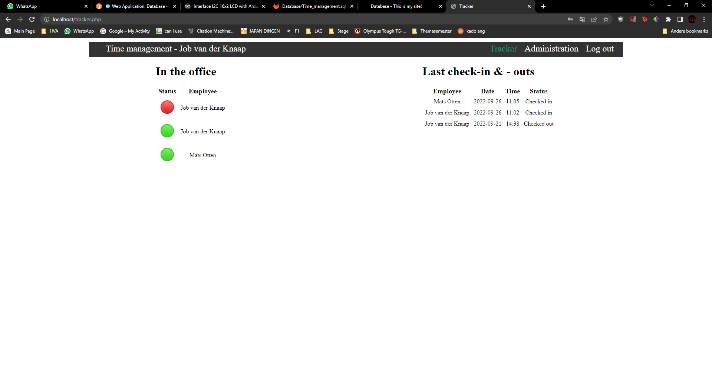
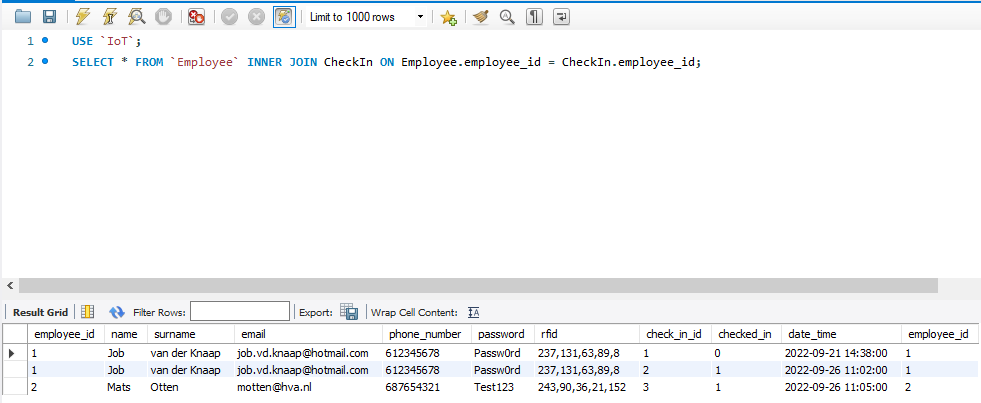

# Database
Here is a screenshot of the tracking page with the connected database and data. In my PHP code I still need to change the query to get the status table working as it should be. In the top left you can see the name of the current user that is logged in. 

---

This is an example of all the data in the database   
