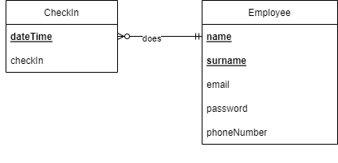
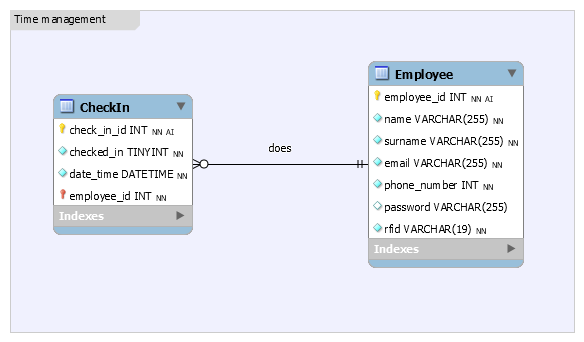

# Database design

## ERD
My current ERD looks like this:<br>
<br>
An employee does the action of checking in. By checking in we get a time and date and we can also see if the employee had checked in. For the employee's we can use there forename and surename as identifier, because nobody had the same name. we have a password for the employers(admins) to login on the admin page. email and phone number are used to easily retrieve contact info and email is also used to login for the admins.


---

## Relational Database
My current Relational Database in phpmyadmin:<br>
<br>

---

## SQL script
The SQL script to create my database for you. [Link to SQL script](https://gitlab.fdmci.hva.nl/IoT/2022-2023-sep-jan/individual-project/iot-knaapj/-/blob/main/Database/Time_management.sql)
```MYSQL
-- MySQL Workbench Forward Engineering

SET @OLD_UNIQUE_CHECKS=@@UNIQUE_CHECKS, UNIQUE_CHECKS=0;
SET @OLD_FOREIGN_KEY_CHECKS=@@FOREIGN_KEY_CHECKS, FOREIGN_KEY_CHECKS=0;
SET @OLD_SQL_MODE=@@SQL_MODE, SQL_MODE='ONLY_FULL_GROUP_BY,STRICT_TRANS_TABLES,NO_ZERO_IN_DATE,NO_ZERO_DATE,ERROR_FOR_DIVISION_BY_ZERO,NO_ENGINE_SUBSTITUTION';

-- -----------------------------------------------------
-- Schema IoT
-- -----------------------------------------------------

-- -----------------------------------------------------
-- Schema IoT
-- -----------------------------------------------------
CREATE SCHEMA IF NOT EXISTS `IoT` DEFAULT CHARACTER SET utf8 ;
USE `IoT` ;

-- -----------------------------------------------------
-- Table `IoT`.`Employee`
-- -----------------------------------------------------
DROP TABLE IF EXISTS `IoT`.`Employee` ;

CREATE TABLE IF NOT EXISTS `IoT`.`Employee` (
  `employee_id` INT NOT NULL AUTO_INCREMENT,
  `name` VARCHAR(255) NOT NULL,
  `surname` VARCHAR(255) NOT NULL,
  `email` VARCHAR(255) NOT NULL,
  `phone_number` INT NOT NULL,
  `password` VARCHAR(255) NULL,
  `rfid` VARCHAR(19) NOT NULL,
  PRIMARY KEY (`employee_id`),
  UNIQUE INDEX `employee_id_UNIQUE` (`employee_id` ASC) VISIBLE)
ENGINE = InnoDB;


-- -----------------------------------------------------
-- Table `IoT`.`CheckIn`
-- -----------------------------------------------------
DROP TABLE IF EXISTS `IoT`.`CheckIn` ;

CREATE TABLE IF NOT EXISTS `IoT`.`CheckIn` (
  `check_in_id` INT NOT NULL AUTO_INCREMENT,
  `checked_in` TINYINT NOT NULL,
  `date_time` DATETIME NOT NULL,
  `employee_id` INT NOT NULL,
  PRIMARY KEY (`check_in_id`, `employee_id`),
  UNIQUE INDEX `check_in_id_UNIQUE` (`check_in_id` ASC) VISIBLE,
  INDEX `fk_CheckIn_Employee_idx` (`employee_id` ASC) VISIBLE,
  CONSTRAINT `fk_CheckIn_Employee`
    FOREIGN KEY (`employee_id`)
    REFERENCES `IoT`.`Employee` (`employee_id`)
    ON DELETE NO ACTION
    ON UPDATE NO ACTION)
ENGINE = InnoDB;


SET SQL_MODE=@OLD_SQL_MODE;
SET FOREIGN_KEY_CHECKS=@OLD_FOREIGN_KEY_CHECKS;
SET UNIQUE_CHECKS=@OLD_UNIQUE_CHECKS;

-- -----------------------------------------------------
-- Data for table `IoT`.`Employee`
-- -----------------------------------------------------
START TRANSACTION;
USE `IoT`;
INSERT INTO `IoT`.`Employee` (`employee_id`, `name`, `surname`, `email`, `phone_number`, `password`, `rfid`) VALUES (1, 'Job', 'van der Knaap', 'job.vd.knaap@hotmail.com', 0612345678, 'Passw0rd', '237,131,63,89,8');
INSERT INTO `IoT`.`Employee` (`employee_id`, `name`, `surname`, `email`, `phone_number`, `password`, `rfid`) VALUES (2, 'Mats', 'Otten', 'motten@hva.nl', 0687654321, 'Test123', '243,90,36,21,152');

COMMIT;


-- -----------------------------------------------------
-- Data for table `IoT`.`CheckIn`
-- -----------------------------------------------------
START TRANSACTION;
USE `IoT`;
INSERT INTO `IoT`.`CheckIn` (`check_in_id`, `checked_in`, `date_time`, `employee_id`) VALUES (1, 0, '2022-09-21 14:38:00', 1);
INSERT INTO `IoT`.`CheckIn` (`check_in_id`, `checked_in`, `date_time`, `employee_id`) VALUES (2, 1, '2022-09-26 11:02:00', 1);
INSERT INTO `IoT`.`CheckIn` (`check_in_id`, `checked_in`, `date_time`, `employee_id`) VALUES (3, 1, '2022-09-26 11:05:00', 2);

COMMIT;
```