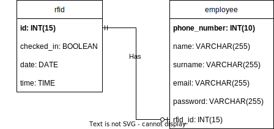

# Database_design

## ERD
My current ERD looks like this:
 
An Employee must have 1 RFID and only one. The RFID can exist without an employee, so it can be assigned to someone else if thats the case. So it doesn't need an employee.
I used phone number as primary key because there are employees who are allowed to log in and not. Only for the admins is an login needed.
