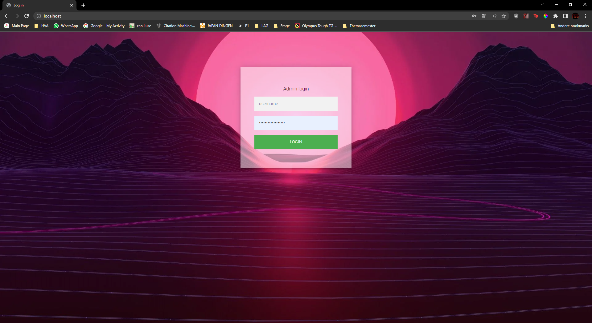

# Front-end

The purpose of the website is for employers to track if employees/employers are inside the company building and at what time the leave or arive. The employer wants to see a list with the active and non active people and next to it a list of when they arive or leave.  

---
### Tracker page
 
This give a great overview of the people who are inside the building and next to it the tracking system. the data isn't correct yet because the back-end isn't added yet. 
[Link to tracker page.](https://gitlab.fdmci.hva.nl/IoT/2022-2023-sep-jan/individual-project/iot-knaapj/-/blob/main/individual-project-docker-main/web/tracker.php)

---

### Login page
 
Simple login screen with a nice background. 
[Link to login page.]([/individual-project-docker-main/web/index.php](https://gitlab.fdmci.hva.nl/IoT/2022-2023-sep-jan/individual-project/iot-knaapj/-/blob/main/individual-project-docker-main/web/index.php))

---

### CSS
I made one file [app.css]([/individual-project-docker-main/web/static/css/app.css](https://gitlab.fdmci.hva.nl/IoT/2022-2023-sep-jan/individual-project/iot-knaapj/-/blob/main/individual-project-docker-main/web/static/css/app.css)) which has design elements that are global like the navigation bar and in the future the footer.
Then I have separate per individual page for the styling. 
[index.css](https://gitlab.fdmci.hva.nl/IoT/2022-2023-sep-jan/individual-project/iot-knaapj/-/blob/main/individual-project-docker-main/web/static/css/index.css) for the login page. 
[tracker.css](https://gitlab.fdmci.hva.nl/IoT/2022-2023-sep-jan/individual-project/iot-knaapj/-/blob/main/individual-project-docker-main/web/static/css/tracker.css) for the tracker page. 
[admin.css](https://gitlab.fdmci.hva.nl/IoT/2022-2023-sep-jan/individual-project/iot-knaapj/-/blob/main/individual-project-docker-main/web/static/css/admin.css) for the admin page.

---

### Javascript
