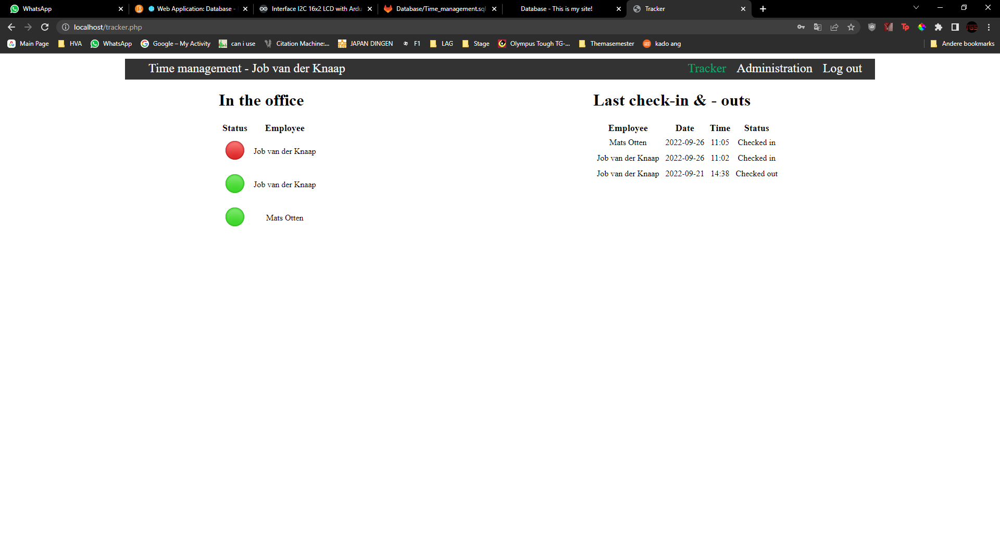

# Front-end

The purpose of the website is for employers to track if employees/employers are inside the company building and at what time the leave or arive. The employer wants to see a list with the active and non active people and next to it a list of when they arive or leave.  

---
### Home page
 
This give a great overview of the people who are inside the building and next to it the tracking system. the data isn't correct yet because the back-end isn't added yet. 

---

### Login page
 
Simple login screen with a nice background. 
 

---

### CSS
I made one file  which has design elements that are global like the navigation bar and in the future the footer.
Then I have separate per individual page for the styling. 
 for the login page. 
 for the tracker page. 
 for the admin page.

---

### Javascript
