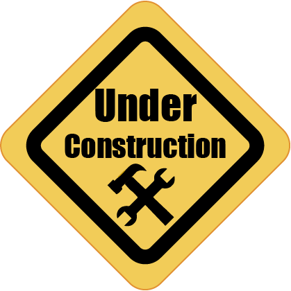

# Practice markdown
## Tables
| Animal | Age | Name   |
|--------|-----|--------|
| Dog    | 12  | Jeff   |
| Bird   | 8   | Tweety |

| Animal | Age | Name   | meer | 
|:-:	 |:-:  |:-:     |:-:   |
| Dog    | 12  | Jeff   | meer |
| Bird   | 8   | Tweety | meer |

## Links
- [Rick roll](https://youtu.be/dQw4w9WgXcQ)
- [mkdocs index pagina](index.md)
- [go to videos](##Videos)

<center>

## Images
|Image 1|Image 2|Image3| 
|:-:|:-:|:-:|
|||| 

</center>

## Code Blocks
#### Javascript example
```javascript
class Ball{// this is a class for a ball
    Constructor(){
        this.position = {x:100, y:100} //Inserts X, Y position at 100, 100
    }
}
```

#### Bash example
```bash
#! /bin/bash
echo "enter your name"
read name #Getting user input and insert into name
echo "Welcome $name to my website"
```

#### Markdown example
```markdown
# headline
this is a normal text
*Italic text*
**Bold text**
table
| Head | Head | Head | Head | 
| :-: | :-: | :-: |:-: | <!--- this is to center the items in the table>
| Item | Item | Item | Item |
| Item | Item | Item | Item | 
```

####C++ example
```c++
#include <iostream> //includes package
using namespace std;

int main() {    
    float n1, n2, n3;

    cout << "Enter three numbers: ";
    cin >> n1 >> n2 >> n3; //User in put 3 numbers

    //Compares all numbers to find the largest
    if(n1 >= n2 && n1 >= n3)
        cout << "Largest number: " << n1;

    if(n2 >= n1 && n2 >= n3)
        cout << "Largest number: " << n2;
    
    if(n3 >= n1 && n3 >= n2)
        cout << "Largest number: " << n3;
  
    return 0; //Closes program
}
```
## Videos
<video controls poster=""> <source src="images/Kube_animatie.mp4" type="video/mp4"></video>

## admonitions
!!! tip
    The video is from a previous project.

??? bug
    Watch out for creepy crawlers.

??? warning
    Careful this is not a hppts site.

!!! quote
    "When lemons give you life"