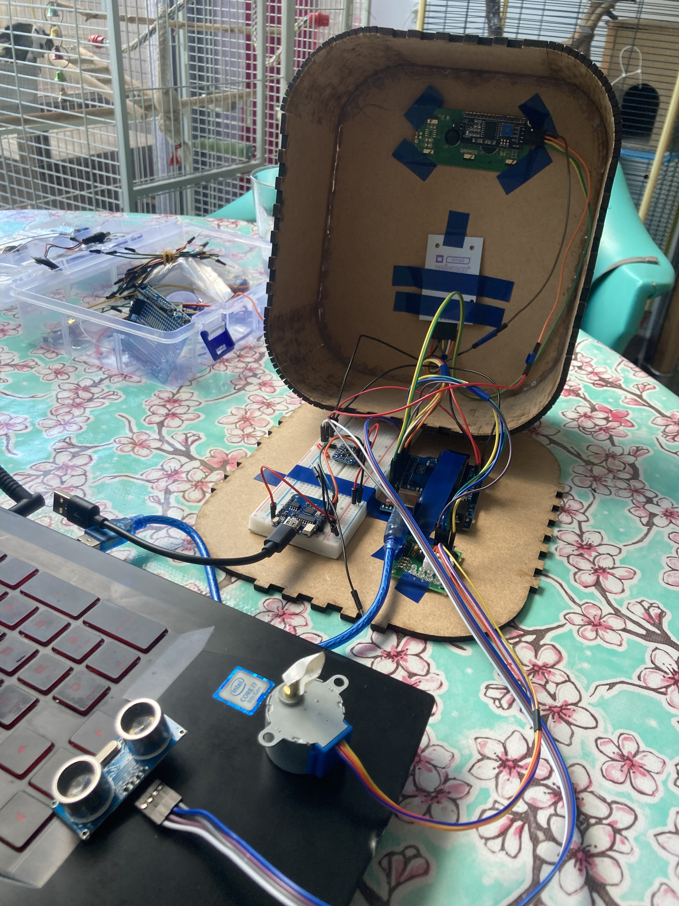
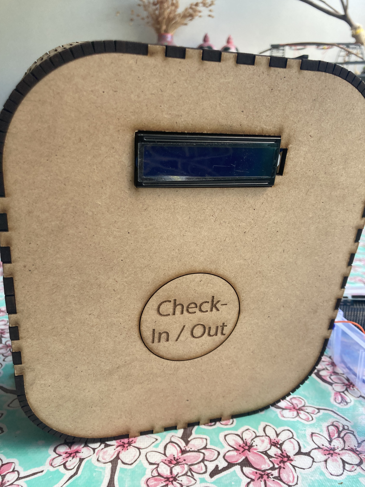

# Prototype
I'm pretty happy about my prototype, the size is good and stands out quite nicely. Sadly I made the LCD hole a bit to small so I will enlarge it by a milimeter. At this point in time it's a closed box because my idea was to use batteries. I found out that opening and closing the box is a hassle so to make it easier I decided to create some holes in the bottom of the box to put the wires trough. Also I added an ultrasonic sensor and stepper motor that has to get a nice spot. So I will also put those cables through those holes or maybe even create a designated spot for the ultrasonic sensor in the front of the case but I think I won't be doing that. The box is gonna stand on a pedestal and the box is gonna be tilted by about 30 degrees for the user to see the LCD better. everything else looked and felt right, and there is enough space for the controllers inside the box.
 
s