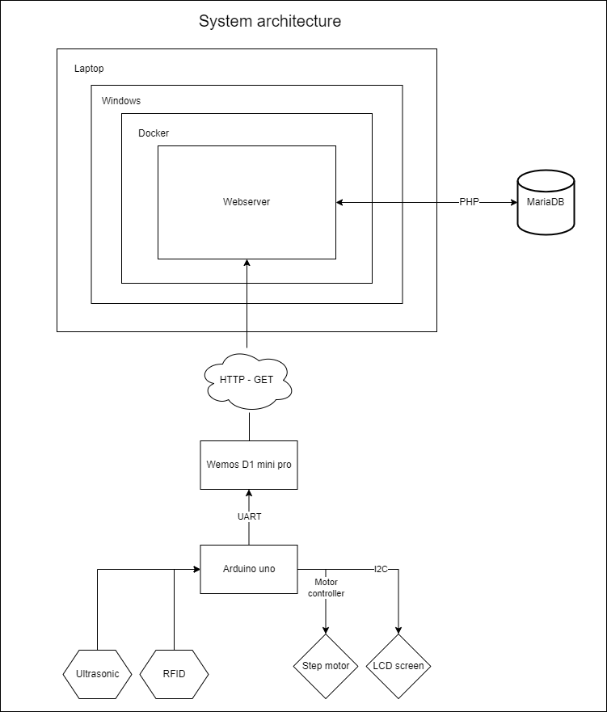

# System architecture
Here you can see a schematic of the architecture of my project. As yo can see I only use the arduino to send sensor data to the Wemos using uart. I have a bidirectional level shifter which converts the 5V to 3.3 and vice versa. I send the RFID id to the webserver so that PHP can handle the insert to the database. Which will add a new check in or out depending on the previous data. 
